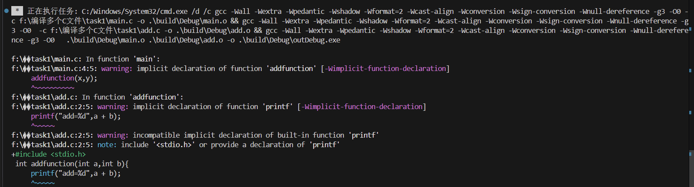
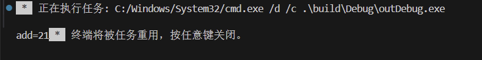

github使用练习

记录

# 这个文件夹只用于完成任务
## 一.所用文件:
1.[add.c](../task1/add.c)
2.[main.c](../task1/main.c)
## 二.编译图片:

## 三.运行图片:

## 四.环境变量,静态库,动态库的个人理解:
>环境变量:用于查找文件地址

>静态库:编译时链接,成为可执行的一部分,执行速度快,但统一保存在磁盘,占据内存大

>动态库:只有运行时才加载,占据内存较小,但使用麻烦
